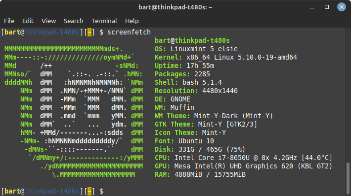
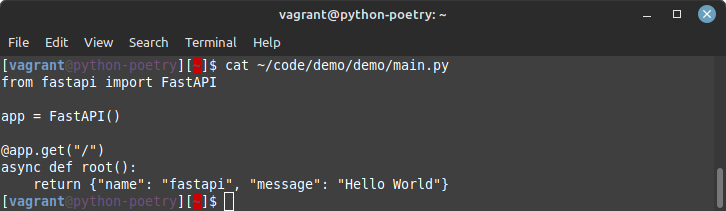
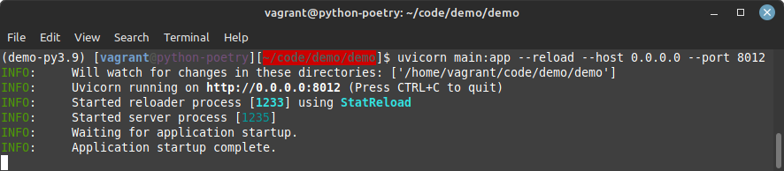
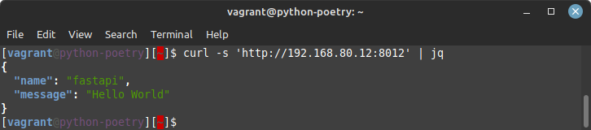

# Vagrant - Python - Poetry - for FastAPI

This is a repository for setting up a FastAPI site. This is set up using Vagrant and Python Poetry.

These links have been visited during this journey:

- [Vagrant](https://developer.hashicorp.com/vagrant)
- [Python Poetry](https://python-poetry.org/docs/)
- [FastAPI](https://fastapi.tiangolo.com/)
- [FastAPI tutorial](https://fastapi.tiangolo.com/tutorial/first-steps/)

## Vagrant UP

First, we will fire up a Vagrant virtual machine, using the Vagrantfile from this repo.

### General

This Vagrantfile will
- use VirtualBox
- install debian (bento/debian-11.4)
- set up network 192.168.80.12
- forward port 8012
- synch folder 'data' (containing some handy files)
- synch folder 'code' (for setting up poetry project and FastAPI)
- configure data/dot-bashrc.fordebian as the .bashrc
- configure data/dot-tmux.conf.fordebian as the .tmux.conf (for colored prompt)
- provision (as root)
  - python3-distutils (needed for Poetry)
  - curl, tmux, tree, jq (some handy little tools)
- provision (as user)
  - python-poetry
  - show the proces of (yes, you need to do this part yourself)
    - creating a python-poetry project
    - setting up a FastAPI "Hello World" example in this python-poetry project

### Prerequisites

I have done this setup on my home Linux laptop, running Linux Mint LMDE

  

- VirtualBox
  - in my setup I used VirtualBox 6.1
- Vagrant
  - in my setup I used Vagrant 2.2.14

### Let's start

- clone this repo in a new directory
- enter this new directory
- fire up the Vagrant VirtualBox machine

      vagrant up

## Vagrant SSH

We should now have a Vagrant virtual machine running.

Setting up the Poetry project can be done using the terminal inside your Vagrant machine.  
Access the machine via:

    vagrant ssh

Your prompt should look like this now:

    [vagrant@python-poetry][~]$

### Poetry project

The following only describes the happy path. Hope all goes well for you too.  
If not, let the internet help you.

Create a new project in the code directory:

    cd ~/code
    poetry new demo
    cd demo
    poetry shell

Your prompt should look like this now:

    (demo-py3.9) [vagrant@python-poetry][~/code/demo]$

Add the python modules needed for your FastAPI project

    poetry add fastapi
    poetry add uvicorn

Create your FastAPI app

    cd demo
    cp ~/data/main.py.forFastAPI ~/code/demo/demo/main.py

'''python
from fastapi import FastAPI

app = FastAPI()

@app.get("/")
async def root():
    return {"name": "fastapi", "message": "Hello World"}
'''

  

Ready? It should be, if your setup looks like this:

    (demo-py3.9) [vagrant@python-poetry][~/code/demo/demo]$ tree ~/code

    /home/vagrant/code
    ├── demo
    │   ├── demo
    │   │   ├── __init__.py
    │   │   └── main.py
    │   ├── poetry.lock
    │   ├── pyproject.toml
    │   ├── README.md
    │   └── tests
    │       └── __init__.py
    └── someinfo.txt

Run your FastAPI webserver (in the ~/code/demo/demo/ directory)

    uvicorn main:app --reload --host 0.0.0.0 --port 8012

The following output indicates that all went well, and your api is ready to be served:

  

Surf to the FastAPI site

- Inside your Vagrant SSH shell:

      curl -s 'http://127.0.0.1:8012' | jq

    

- Via your browser on your host:

      http://192.168.80.12:8012/
      http://192.168.80.12:8012/docs
      http://192.168.80.12:8012/redoc
